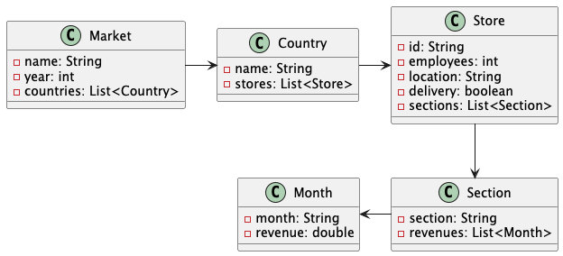

# Lazy Evaluation

Some resources:

## Data diagram

## A small poem

> Data once alive
>
> Shaped, mapped, filtered through its paths—
>
> Parallel in flight
>
> Yet no end would call its name
>
>And the final call found none

## Time table

### Data

| Method                   | `A` | `B` | `C` | `D` | `E` | `F` | `G` | `H` |
|--------------------------|:---:|:---:|:---:|:---:|:---:|:---:|:---:|:---:|
| Without Lazy Evaluation  |     |     |     |     |     |     |     |     |
| With Lazy Evaluation     |     |     |     |     |     |     |     |     |

### Legend

* `A` - ALL COUNTRIES
* `B` - STORES BY COUNTRY
* `C` - LOCATIONS BY COUNTRY
* `D` - SECTIONS BY STORE
* `E` - TOTAL REVENUE
* `F` - TOTAL REVENUE BY COUNTRY
* `G` - TOTAL REVENUE BY COUNTRY AND STORE
* `H` - TOTAL REVENUE BY COUNTRY AND STORE AND SECTION
